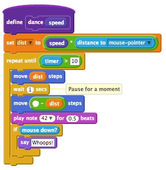

# scratchblock
NodeJS version of scratchblocks2 to compile scratch blocks into HTML server-side.
Anything between `<scratch>` and `</scratch>` will be transformed into scratchblocks2 html code.
The inline attribute (`<scratch inline>`) will result in inline scratchblocks2 html code.
You then need to load the [scratchblocks2 css file](https://github.com/tjvr/scratchblocks/blob/master/build/scratchblocks2.css) on the page that the html will be displayed on.

For instance, a file with the contents of
```
<scratch>
	when gf clicked
	forever
	   turn cw (15) degrees
	   say [Hello!] for (2) secs
	   if <mouse down?> then
	      change [mouse clicks v] by (1)
	   end
</scratch>
```

is transformed into



To use, load it in your gruntfile and then specify files for it to run in like this

```
scratchblock: {
	generate: {
		files: [
			{expand: true, src: ['test/*.html'], dest: "", ext: ".parsed.html", exclude: "test/*.parsed.html"}
		]
	}
}
```

## Based on scratchblocks2
This package is reliant on large portions of MIT-licensed [scratchblock2](https://github.com/tjvr/scratchblocks).
